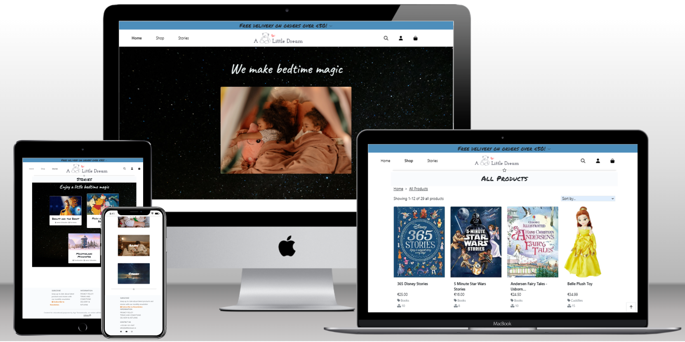
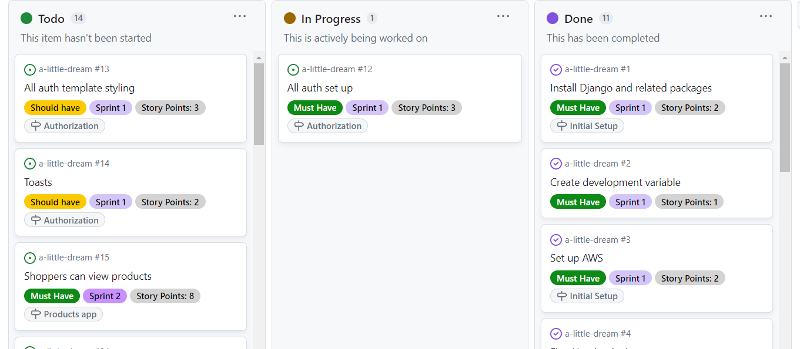

# A Little Dream

A Little Dream is a fictional online store focusing on a range of different products with a common theme - making bedtime a magical experience for children. The live site deployed on Heroku
can be accessed here [A Little Dream](https://a-little-dream-23a29b7469db.herokuapp.com/).

## Table of contents

- [User Experience Design](#user-experience-design)
  - [The Strategy Plane](#the-strategy-plane)
    - [Site Goals and Business Model](#site-goals-and-business-model)
    - [Agile Planning](#agile-planning)
      - [Epics & User Stories ](#epics-and-user-stories)
  - [The Scope Plane](#the-scope-plane)
  - [The Structure Plane](#the-structure-plane)
    - [Features](#features)
    - [Future Features](#future-features)
  - [The Skeleton Plane](#the-skeleton-plane)
    - [Wireframes](#wireframes)
    - [Database Design](#database-design)
  - [The Surface Plane](#the-surface-plane)
    - [Design](#design)
    - [Colour Palette](#colour-palette)
    - [Typography](#typography)
    - [Imagery](#imagery)
- [Marketing and SEO](#marketing-and-seo)
    - [Marketing](#marketing)
    - [SEO](#seo)
- [Technologies](#technologies)
- [Testing](#testing)
- [Deployment](#deployment)
  - [Version Control](#version-control)
  - [Heroku Deployment](#heroku-deployment)
  - [Fork Project](#fork-project)
  - [Clone Project](#fork-project)
- [Credits](#credits)

# User Experience Design

## The Strategy Plane

### Site-Goals and Business Model

The primary goal of the site is to showcase the online store and it's unique set of products to shoppers. The theme both site and store focus on is bedtime and putting children to sleep. It's a business to customer model (B2C), where individual shoppers can browse and purchase products, as well as read stories, which are also a part of the marketing strategy. Shoppers can register and log in for a more customized experience enabled by accessing their own profiles.

### Agile Planning

The project was developed with agile approach. Work was delivered in small increments spread over 4 sprints. The tasks were
categorized in a total of 12 epics and 41 user stories. Each user story was assigned approximation of story points. Each user story was
also given one of the 3 labels - must have, should have, could have. User stories were given acceptance criteria and a list of tasks to complete. All user stories were moved following To Do - In Progess - Done methodology. Some of the could have user stories were moved to a Future Deployments category, as they were postponed for future deployments.  
User stories were created from a custom GitHub issue template, which had also been created for this project. Completed user stories were closed as issues, while the future ones were left as open issues. Kanban board from Github Project was used and can be viewed
[here](https://github.com/users/AgaToma/projects/4/views/1).

#### Epics & User Stories 

**Epic 1 - Initial Setup**  
User stories:

- Install Django and related packages - As a Developer, I can setup my workspace, so that I can start working on the project
- Set up AWS - As a Developer, I can store media on AWS, so that they are correctly displayed
- First Heroku deployment - As a Developer, I can verify that initial settings are working correctly, so that I can continue with the project
- Base template - As a Developer, I can use base template as a basic building block, so that I can continue with the rest of the project

**Epic 2 - Home app**  
User stories:

- Landing page set up - As a Shopper, I can see information about the store, so that I can find out about their business
- Navbar - As a Shopper, I can navigate the site easily, so that I can get what I want
- Footer - As a Shopper, I can find some additional information about the business, so that I can get to know it better
- Landing page basic styling and hero image - As a Shopper, I can enjoy the home page aesthetics, so that I understand the business is serious about user experience
- Landing page links, motto and description cards - As a Shopper, I can find more description about product categories and business profile, so that I can make better purchasing decisions
- Logo and favicon - As a Shopper, I can visually identify the store logo or icon, so that I see it among other tabs and recognize the brand

**Epic 3 - Authorization**  

- All auth set up - As a Business owner, I can restrict user access based on permissions, so that I can achieve good security on the site
- All auth template styling - As a Shopper, I can enjoy uniform styles on authentication pages, so that the experience feels harmonious
- Toasts - As a Shopper, I can want to receive feedback on my operations, so that I know if they're successful or what went wrong

**Epic 4 - Products app**  

- Shoppers can view products - As a Shopper, I can view products, so that I can decide whether to buy them
- Products are displayed in visually appealing way - As a Shopper, I can view product list and details, so that I can decide whether to buy them
- Product CRUD for site owner/staff in Admin UI - As a shop owner, I can create, edit, delete products, so that I can keep a diverse product portfolio
- Stock count - As a Shopper, I can see if the products I'm interested in are low or out of stock, so that I can make an informed decision
- Product CRUD for admin users in the site UI - As a store owner/admin, I can add and update products without going to admin UI, so that it's more efficient

**Epic 5 - Bag app**  

- Bag set up - As a Shopper, I can add products to bag, so that I can buy them
- Shoppers can view bag - As a Shopper, I can view my bag in a visually appealing way, so that I'm happy with the shopping experience
- Home app - As a developer, I can use home url, so that I can confirm the project is running correctly
- Error pages - As a site user, I can clearly see the error, so that I know what went wrong

**Epic 6 - Checkout app**  

- Shoppers are able to proceed to checkout - As a Shopper, I can proceed to checkout, so that I can make a purchase
- Shoppers can pay to complete checkout - Stripe - As a Shopper, I can pay online, so that I can complete shopping
- Shoppers can view checkout - As a Shopper, I can view checkout, so that I can complete it

**Epic 7 - Profiles app**  

- Logged in shoppers can access their information - As a Shopper, I can access my profile, so that I can view my address and order history
- Logged in shoppers can update their address - As a Shopper, I can update my address

**Epic 8 - Reviews app**  

- Shoppers can write reviews of products - As a shopper, I can express how I feel about a product, so that other shoppers and store owner can benefit from my experience
- Shoppers can view reviews of products - As a shopper, I can read other people's reviews, so that I can make informed decision about purchase

**Epic 9 - Stories app**  

- Shoppers can read stories on the site - As a Shoppers, I can read stories, so that I can get in the right mood
- Site owners can perform CRUD on stories on the site - As a site owner, I can create, update, delete story, so that I can keep them relevant for my business needs

**Epic 10 - Final styling, responsiveness, error pages**  
- Shoppers can browse the site on different devices - As a shopper, I can view the site on different screen sizes, so that I have more flexibility
- Shoppers can enjoy uniform styling through the website - As a shopper, I can enjoy website style, so that I like my shopping experience
- Error pages - As a shopper, I can see when link is not working, so that I can go back to the correct one

**Epic 11 - Final deployment and documentation**  

- Site map - As a developer, I have a site map, so that my site has better SEO
- Website is live on Heroku - As a store owner, I have a live site, so that my customers can shop
- Documentation - As a developer, I can present detailed documentation, so that others can find out what my project is about

**Epic 11 - Web Marketing**  

- Shoppers can view store page on Facebook - As a store owner, I can reach more shoppers via social media, so that I can increase sales
- Shoppers can subscribe to a newsletter - As a Shopper, I can subscribe to a newsletter, so that I can keep up to date with news from the store
- Shoppers can view privacy policy - As a shopper, I can find the store privacy policy, so that I'm well informed

## The Scope Plane

**Intuitive UI and relevant content**

- Navigation available throughout the site
- Visual feedback given to users when needed
- Page content relevant to purpose with matching descriptive headings

**Responsiveness**  
Site is functional and maintains full presentabillity on different screen sizes from 320 px up.

**CRUD**

- Unregistered users can place orders and have view only access to products, stories, reviews
- Admin users can create, view, update and delete products (Products App)
- Admin users can create, view, update and delete stories (Stories App)
- Logged in shoppers can create, view, update and delete reviews (Reviews App)
- Logged in shoppers can view and update profiles (Profiles App)
- Superusers can create, view, update and delete orders, profiles, users - via Django admin interface 

**Home page and customized user interface for guest users**

- Guest users can view home page with b&b information
- Guest users can navigate the site via navbar
- Guest users can create accounts with email address and not username
- Navbar is customized depending if user is logged in or not
- Logged in guest users can perform CRUD in customized user interface (detail pages and forms on the site)

**Customized user interface for admin and super users**

- Admin users can can perform CRUD on products and stories in customized user interface (detail pages and forms on the site)
- Admin superusers have role based custom navbar with added admin links and additional buttons/links in products & stories apps

**Security - role based restrictions**

- Separation of staff/admin users and guest users capabilities and access:
  - Staff users have more options on their navbar
  - Staff users have more options on products and stories pages
  - Staff users can see all orders in admin UI
  - Logged in shoppers have access to profiles with their address and order history
  - Logged in shoppers can add and edit reviews
  - Unregistered users can place orders via bag and checkout and view products, stories, reviews
  - Unregistered users have no profile access and view only access to reviews

**Backend organized in separate apps**

- Home app
- Products app
- Bag app
- Checkout app
- Profiles app
- Reviews app
- Stories app

## The Structure Plane

### Flow

**Products App**

- Original product set was created via fixtures
- Further products can be added and updated by admins via Django Admin UI or custom form directly on the site
- Stock count feature implemented and displayed
- Rating feature implemented via Reviews app
- Product model was customized to align with business goals
- Target age model was added to support choices for appropriate age groups
- A model to generate sku for newly added products was created

**Bag and checkout**

- Enables all shoppers to place orders
- Payments done via Stripe - no actual payments are captured, this is a test feature
- Stock is updated when a new order is placed
- Orders are saved to profiles

**Authentication and Profiles**
- Shoppers can register via customized all auth forms
- Upon registration a profile is created
- Profiles contain user details, which users can update
- Profiles contain order history with further access to order confirmation details
- Admins can delete profiles via admin UI

**Reviews**

- All shoppers can view reviews
- Logged in shoppers can add reviews and rating via custom form on product details
- Ratings average is posted to product details
- Custom review model was created

**Stories**

- All shoppers can view stories
- Admins can add, update, delete stories both via admin UI and via custom form on the website
- Stories are linked to related products as part of marketing strategy
- Stories are linked to appropriate age groups
- Custom story model was created

### Features

**Navigation**

Site wide responsive Bootrstrap navbar was added for easy navigation between pages. To achieve responsiveness it
collapses to hamburger on smaller screens. It contains different links depending on whether the user is logged in and
user role. It also contains a search box for rooms search with custom tooltip containing search instructions.
Navbar is placed in the header template (main project templates).

**Footer**

Footer is visible across all pages on the site. It contains social media links, so that guests can follow the b&b, if they like.

**Home page**  
The goal of home page is to present the B&B to potential guests and get them interested. It contains hero image, bed and breakfast description with information about rooms, breakfasts, bookings and payments. Bookings and payments section is collapsible to avoid clutter on smaller devices. There is also a Bootstrap carousel with more breakfast details.
Below description, there is a location information. Home page is part of a home app, shown from index template.

**Sign up form**  
Form is provided to allow users to register. Signup template was taken from allauth module and styled to match the site appearance.

**Log in form**  
Form is provided to allow users to log in. Login template was taken from allauth module and styled to match the site appearance.

**Log out**  
Logout template was taken from allauth module and styled to match the site appearance. Before logging the user out it confirms, if user wants to log out.

**Create room page**

Within the Rooms app, Create Room page with form was made to provide a friendly UI to staff admin users without them having to use Django admin, when they need to add a new room to the b&b offer. This is only accessibly to staff users, access is restricted via mixins.

**Edit room page**

Within the Rooms app, Edit room page with form was made to provide a friendly UI to staff users without them having to use Django admin, when they need to edit details of an exisiting room in the b&b offer. This is only accessibly to staff users, access is restricted via mixins.

**Rooms page**

Rooms page was created to show a list of all available rooms on offer. Bootsrap cards were used to display rooms, showing room names, photos and basic details like capacity and view. It's in the Rooms app and is accessible to all viewers of the website without restrictions.

**Room Details**

Users are directed to respective Room details page after clicking on one of the room cards on Rooms page. They can see a more detailed room description there, price and room number. This is visible for any viewers, but options vary depending on permissions. If a user is not logged in, they can see instructions how to book the room (log in or call b&B). If they are logged in, they can see "Book Room" button. If they are admin, they can also see "Edit Room" button, which directs to Edit Room page and "Delete Room", which allows to perform delete operation. Before proceeding with the deletion, user is asked to confirm, it they want to delete.

**New booking page**

New booking page and form are a part of Bookings app. Logged in user can access them from Room Details or Home Page. There is validation implemented to ensure the input of required and correct information. No fields can be left empty, if a room with less capacity then entered is selected a descriptive error message is displayed to the user, if user selects earlier check out than check in, a descriptive error message is also displayed. If the selected room is not available during selected dates due to another booking, a message is also displayed informing user of the same.

**Bookings list page**

Bookings list page was made within Bookings app, so that logged in users can view their own bookings. Bookings are ordered by check in date. Staff users can see all bookings and can perform search using booking id in this UI. If a search with different parameters is needed, they need to use Django admin interface. Secure access according to designed permissions is ensured via mixins.

**Booking details**

After clicking on the booking card on Bookings list page, the user can view their booking summary. They also have buttons available to edit the booking, which directs to edit booking form or delete booking, where a confirmation is required before deletion is completed.

**403 and 404 error pages**  
Error pages were created for a friendly way of informing the user that they have no access to view a requested page (403) or that a page they requested doesn't exist (404). Both error pages contain a message and link to redirect the user back to home page.

**Confirmation messages**

Pop up messages were implemented to inform the user about successful sign in, log out and booking.

**Favicon**  
Favicon was added to enable user locating the tab easier when multiple tabs are open.

### Future Features

- 

## The Skeleton Plane

### Wireframes

Wireframes were created with Balsamiq. Click below to expand for details.

  
Home page

  
Sign up page

  
Log in page

  
Log out page

  
Rooms page

  
Create room page

  
Edit room page

  
Room details page

  
New booking page

  
My bookings page

  
Booking details page

### Database Design

This project uses PostresQL database hosted on [Elephant SQL](https://www.elephantsql.com/). There are three custom models in the database: Custom User, Room and Booking. The models are related via Foreign Key relationships. Relationship type can be viewed on the first diagram which was drawn for the design of the database using [Draw SQL](https://drawsql.app/). The second diagram was generated after completion of the project from the ready database with [DBeaver](https://dbeaver.io/).
Social accounts, groups and emails models from allauth modules visible in Django admin were not actively used in the current version, but were left for future deployments.

## The Surface Plane

### Design

Site is responsive and features multiple pages to avoid clutter. It features Bootstrap navbar and cards to
enhance balance and responsiveness and also Bootstrap carousel for an attractive look. Bootrstrap collapsibles were implemented
in description on home page to avoid text clutter on smaller devices. Navbar links have active class, all links highlight on hover with the exception of logo link. This link is primarily implemented for SEO optimization and highlighting logo was not in harmony with the rest of navbar.

### Color palette

Light colors were primarily used, whites and light grays. Light shades of green and blue were used
for active classes and background effects. Colors were chosed to harmonize with the hero image.

### Typography

Courgette and Marck Script, both cursive fonts were used to overwrite the default Bootstrap and browser styles for navbar and headings only. Fonts were obtained from Google fonts.

### Imagery

B&B logo was created on Canva. Hero image and room images were taken from [Pexels](https://www.pexels.com/). All photos were
selected to match the light color design of the site aligned with sea, sky, cliffs and lighthouse colors of the hero image.

# Web marketing and SEO

## SEO

## Web marketing

# Technologies

- HTML - the structure of the website was developed using HTML
- CSS - the website was styled using custom CSS in an external file
- Python - for programming within Django framework
- [Django](https://www.djangoproject.com/) - framework for building the project using Python as programming language
- [Bootstrap 5](https://getbootstrap.com/docs/5.0/getting-started/introduction/) - used for adding some predefined elements and styling
- Jinja/Django templating - used to inject dynamic data and queries into HTML pages
- [Favicon.io](https://favicon.io/) - to make favicon
- [Google fonts](https://fonts.google.com/) - Courgette and Marck Script fonts were used
- Chrome Dev Tools - testing/validation/troubleshooting.
- [CodeAnywhere](https://app.codeanywhere.com/) - website was developed with this IDE in Chrome
- GitHub - for hosting source code
- Git - used to commit and push code during the development of the Website
- [Tinypng](https://tinypng.com/) - was used to reduce the size of the images
- [Convertio](https://convertio.co/) - for JPG format gallery photos to webp
- Balsamiq - to create wireframes
- [Canva](https://www.canva.com/) - to create site logo
- [Heroku](https://id.heroku.com/login) - to deploy and host live site
- [Font Awesome](https://fontawesome.com/) - for icons on the site
- [DrawSQL](https://drawsql.app/) - to create initial DB schema
- [DBeaver](https://dbeaver.io/) - to create ER diagram after deployment
- [Cloudinary](https://cloudinary.com/) - for static storage
- [Elephant SQL](https://www.elephantsql.com/) - PostreSQL DB

**Python modules**

- Django==3.2.19
- Django class based views - ListView, UpdateView, DeleteView, CreateView - for classes to create, edit, delete and display
- Mixins - LoginRequiredMixin, UserPassesTestMixin - for permissions based restrictions
- Q - for search queries
- messages - for showing user feedback
- date, datetime - for date usage and operations
- cloudinary==1.32.0 - static file/image storage
- dj-database-url==0.5.0 - o parse database url for production environment
- dj3-cloudinary-storage==0.0.6 - storage system to work with cloudinary
- django-allauth==0.54.0 - for authentication
- gunicorn==20.1.0 - WSGI server
- oauthlib==3.2.2 - installed as dependency with another packag
- psycopg2==2.9.6 - for Heroku deployment
- django-richtextfield==1.6.1 - for using custom styling on form fields
- django-crispy-forms==2.0 - for serving forms
- crispy-bootstrap5==0.7 - allow bootstrap5 use with crispy forms
- whitenoise - to solve issue with static file loading after deployment to Heroku

# Testing

Tests description and results are available in a separate [TESTING.md](TESTING.md) file.

# Deployment

## Version Control  

The following commands were used for version control.

- git add . - add changes to staging area before committing
- git commit -m "commit message" - committing staged changes to the local repository
- git push - pushing commited changes to the GitHub remote repository

## Heroku deployment

Below steps were followed to deploy the project:

- Log in to Heroku
- Click "New -> Create new app" button
- Insert app name, choose region, click the "Create App" button
- On Settings tab go to "Config vars" section, click "Reveal Config Vars"
- Add the following config vars:
  - SECRET_KEY: (secret key)
  - DATABASE_URL: (postresql url)
  - CLOUNDINARY_URL: (cloudinary api url)
- On Deploy tab go to "Deployment method" and select Github
- Go to "App connected to GitHub", type GitHub repository name to link it
- Manual deployment was chosen on the main branch

## Fork repository

Click Fork button on the top right -> select owner -> optionally change name or add description -> create Fork.

## Clone repository

Click on the code button -> select clone with HTTPS, SSH or GitHub CLI -> copy the link shown -> open terminal in your code editor and change the current working directory to the location you want to use for the cloned directory -> type 'git clone' into the terminal and then paste the copied link -> press enter.

# Credits

## References

Below resources were used as reference when creating the project along with Stack Overflow and Code Institute Slack community posts. 
[Django Wednesdays](https://www.youtube.com/watch?v=HHx3tTQWUx0&list=PLCC34OHNcOtqW9BJmgQPPzUpJ8hl49AGy)  
[Django Recipe Tutorial](https://www.youtube.com/watch?v=sBjbty691eI&list=PLXuTq6OsqZjbCSfiLNb2f1FOs8viArjWy&pp=iAQB)

## Images

- 403 & 404 - freefrontend.com
- breakfast in bed - pexels-lisa-fotios-1843244
- continental breakfast - pexels-burst-374052
- irish breakfast - pexels-emrah-tolu-2662875
- vegan - pexels-pixabay-236795
- gluten free - pexels-taryn-elliott-4099238
- hero img - pexels-magic-k-6726764

## Acknowledgments

Big thanks to my Code Institute mentor [Daisy McGirr](https://github.com/Daisy-McG) - for her guidance, support and useful insights.

## Credits
Hero backgrond image - pexels-francesco-ungaro-998641
Hero front image - pexels-ron-lach-8262594
Hero front image 2 - pexels-cottonbro-studio-6670074
Hero front image 3 - pexels-cottonbro-studio-5801245
Books - pexels-pavel-danilyuk-7938252
Lights - pexels-matheus-bertelli-13869602
Stories - johannes-plenio-DKix6Un55mw-unsplash
Story 1 - nightforest_by_maril1_dadimvp-fullview