# A Little Dream

A Little Dream is a fictional online store focusing on a range of different products with a common theme - making bedtime a magical experience for children. The live site deployed on Heroku
can be accessed here [A Little Dream](https://a-little-dream-23a29b7469db.herokuapp.com/).

## Table of contents

- [User Experience Design](#user-experience-design)
  - [The Strategy Plane](#the-strategy-plane)
    - [Site Goals and Business Model](#site-goals-and-business-model)
    - [Agile Planning](#agile-planning)
      - [Epics & User Stories ](#epics-and-user-stories)
  - [The Scope Plane](#the-scope-plane)
  - [The Structure Plane](#the-structure-plane)
    - [Features](#features)
      - [Site wide](#site-wide)
      - [App related](#app-related)
    - [Future Features](#future-features)
  - [The Skeleton Plane](#the-skeleton-plane)
    - [Wireframes](#wireframes)
    - [Database Design](#database-design)
  - [The Surface Plane](#the-surface-plane)
    - [Design](#design)
    - [Colour Palette](#colour-palette)
    - [Typography](#typography)
    - [Imagery](#imagery)
- [Marketing and SEO](#marketing-and-seo)
    - [Marketing](#marketing)
    - [SEO](#seo)
- [Technologies](#technologies)
- [Testing](#testing)
- [Deployment](#deployment)
  - [Version Control](#version-control)
  - [Heroku Deployment](#heroku-deployment)
  - [Fork Project](#fork-project)
  - [Clone Project](#fork-project)
- [Credits](#credits)

# User Experience Design

## The Strategy Plane

### Site-Goals and Business Model

The primary goal of the site is to showcase the online store and it's unique set of products to shoppers. The theme both site and store focus on is bedtime and putting children to sleep. It's a business to customer model (B2C), where individual shoppers can browse and purchase products, as well as read stories, which are also a part of the marketing strategy. Shoppers can register and log in for a more customized experience enabled by accessing their own profiles.

### Agile Planning

The project was developed with agile approach. Work was delivered in small increments spread over 4 sprints. The tasks were
categorized in a total of 12 epics and 41 user stories. Each user story was assigned approximation of story points. Each user story was
also given one of the 3 labels - must have, should have, could have. User stories were given acceptance criteria and a list of tasks to complete. All user stories were moved following To Do - In Progess - Done methodology. Some of the could have user stories were moved to a Future Deployments category, as they were postponed for future deployments.  
User stories were created from a custom GitHub issue template, which had also been created for this project. Completed user stories were closed as issues, while the future ones were left as open issues. Kanban board from Github Project was used and can be viewed
[here](https://github.com/users/AgaToma/projects/4/views/1).

#### Epics & User Stories 

**Epic 1 - Initial Setup**  
User stories:

- Install Django and related packages - As a Developer, I can setup my workspace, so that I can start working on the project
- Set up AWS - As a Developer, I can store media on AWS, so that they are correctly displayed
- First Heroku deployment - As a Developer, I can verify that initial settings are working correctly, so that I can continue with the project
- Base template - As a Developer, I can use base template as a basic building block, so that I can continue with the rest of the project

**Epic 2 - Home app**  
User stories:

- Landing page set up - As a Shopper, I can see information about the store, so that I can find out about their business
- Navbar - As a Shopper, I can navigate the site easily, so that I can get what I want
- Footer - As a Shopper, I can find some additional information about the business, so that I can get to know it better
- Landing page basic styling and hero image - As a Shopper, I can enjoy the home page aesthetics, so that I understand the business is serious about user experience
- Landing page links, motto and description cards - As a Shopper, I can find more description about product categories and business profile, so that I can make better purchasing decisions
- Logo and favicon - As a Shopper, I can visually identify the store logo or icon, so that I see it among other tabs and recognize the brand

**Epic 3 - Authorization**  

- All auth set up - As a Business owner, I can restrict user access based on permissions, so that I can achieve good security on the site
- All auth template styling - As a Shopper, I can enjoy uniform styles on authentication pages, so that the experience feels harmonious
- Toasts - As a Shopper, I can want to receive feedback on my operations, so that I know if they're successful or what went wrong

**Epic 4 - Products app**  

- Shoppers can view products - As a Shopper, I can view products, so that I can decide whether to buy them
- Products are displayed in visually appealing way - As a Shopper, I can view product list and details, so that I can decide whether to buy them
- Product CRUD for site owner/staff in Admin UI - As a shop owner, I can create, edit, delete products, so that I can keep a diverse product portfolio
- Stock count - As a Shopper, I can see if the products I'm interested in are low or out of stock, so that I can make an informed decision
- Product CRUD for admin users in the site UI - As a store owner/admin, I can add and update products without going to admin UI, so that it's more efficient

**Epic 5 - Bag app**  

- Bag set up - As a Shopper, I can add products to bag, so that I can buy them
- Shoppers can view bag - As a Shopper, I can view my bag in a visually appealing way, so that I'm happy with the shopping experience
- Home app - As a developer, I can use home url, so that I can confirm the project is running correctly
- Error pages - As a site user, I can clearly see the error, so that I know what went wrong

**Epic 6 - Checkout app**  

- Shoppers are able to proceed to checkout - As a Shopper, I can proceed to checkout, so that I can make a purchase
- Shoppers can pay to complete checkout - Stripe - As a Shopper, I can pay online, so that I can complete shopping
- Shoppers can view checkout - As a Shopper, I can view checkout, so that I can complete it

**Epic 7 - Profiles app**  

- Logged in shoppers can access their information - As a Shopper, I can access my profile, so that I can view my address and order history
- Logged in shoppers can update their address - As a Shopper, I can update my address

**Epic 8 - Reviews app**  

- Shoppers can write reviews of products - As a shopper, I can express how I feel about a product, so that other shoppers and store owner can benefit from my experience
- Shoppers can view reviews of products - As a shopper, I can read other people's reviews, so that I can make informed decision about purchase

**Epic 9 - Stories app**  

- Shoppers can read stories on the site - As a Shoppers, I can read stories, so that I can get in the right mood
- Site owners can perform CRUD on stories on the site - As a site owner, I can create, update, delete story, so that I can keep them relevant for my business needs

**Epic 10 - Final styling, responsiveness, error pages**  
- Shoppers can browse the site on different devices - As a shopper, I can view the site on different screen sizes, so that I have more flexibility
- Shoppers can enjoy uniform styling through the website - As a shopper, I can enjoy website style, so that I like my shopping experience
- Error pages - As a shopper, I can see when link is not working, so that I can go back to the correct one

**Epic 11 - Final deployment and documentation**  

- Site map - As a developer, I have a site map, so that my site has better SEO
- Website is live on Heroku - As a store owner, I have a live site, so that my customers can shop
- Documentation - As a developer, I can present detailed documentation, so that others can find out what my project is about

**Epic 11 - Web Marketing**  

- Shoppers can view store page on Facebook - As a store owner, I can reach more shoppers via social media, so that I can increase sales
- Shoppers can subscribe to a newsletter - As a Shopper, I can subscribe to a newsletter, so that I can keep up to date with news from the store
- Shoppers can view privacy policy - As a shopper, I can find the store privacy policy, so that I'm well informed

## The Scope Plane

**Intuitive UI and relevant content**

- Navigation available throughout the site
- Visual feedback given to users when needed
- Page content relevant to purpose with matching descriptive headings

**Responsiveness**  
Site is functional and maintains full presentabillity on different screen sizes from 320 px up.

**CRUD**

- Unregistered users can place orders and have view only access to products, stories, reviews
- Admin users can create, view, update and delete products (Products App)
- Admin users can create, view, update and delete stories (Stories App)
- Logged in shoppers can create, view, update and delete reviews (Reviews App)
- Logged in shoppers can view and update profiles (Profiles App)
- Superusers can create, view, update and delete orders, profiles, users - via Django admin interface 

**Home page and customized user interface for guest users**

- Guest users can view home page with b&b information
- Guest users can navigate the site via navbar
- Guest users can create accounts with email address and not username
- Navbar is customized depending if user is logged in or not
- Logged in guest users can perform CRUD in customized user interface (detail pages and forms on the site)

**Customized user interface for admin and super users**

- Admin users can can perform CRUD on products and stories in customized user interface (detail pages and forms on the site)
- Admin superusers have role based custom navbar with added admin links and additional buttons/links in products & stories apps

**Security - role based restrictions**

- Separation of staff/admin users and guest users capabilities and access:
  - Staff users have more options on their navbar
  - Staff users have more options on products and stories pages
  - Staff users can see all orders in admin UI
  - Logged in shoppers have access to profiles with their address and order history
  - Logged in shoppers can add and edit reviews
  - Unregistered users can place orders via bag and checkout and view products, stories, reviews
  - Unregistered users have no profile access and view only access to reviews

**Backend organized in separate apps**

- Home app
- Products app
- Bag app
- Checkout app
- Profiles app
- Reviews app
- Stories app

## The Structure Plane

### Flow

**Products App**

- Original product set was created via fixtures
- Further products can be added and updated by admins via Django Admin UI or custom form directly on the site
- Stock count feature implemented and displayed
- Rating feature implemented via Reviews app
- Product model was customized to align with business goals
- Target age model was added to support choices for appropriate age groups
- A model to generate sku for newly added products was created

**Bag and checkout**

- Enables all shoppers to place orders
- Payments done via Stripe - no actual payments are captured, this is a test feature
- Stock is updated when a new order is placed
- Orders are saved to profiles

**Authentication and Profiles**
- Shoppers can register via customized all auth forms
- Upon registration a profile is created
- Profiles contain user details, which users can update
- Profiles contain order history with further access to order confirmation details
- Admins can delete profiles via admin UI

**Reviews**

- All shoppers can view reviews
- Logged in shoppers can add reviews and rating via custom form on product details
- Ratings average is posted to product details
- Custom review model was created

**Stories**

- All shoppers can view stories
- Admins can add, update, delete stories both via admin UI and via custom form on the website
- Stories are linked to related products as part of marketing strategy
- Stories are linked to appropriate age groups
- Custom story model was created

### Features

#### Site wide

**Navigation**

Site wide responsive Bootrstrap navbar was added for easy navigation between pages. To achieve responsiveness it
collapses to hamburger on smaller screens. Search icon expands to a search bar when clicked. Shop link expands to Products menu with product categories, Account icon expands to Register & Login menu or, if user is logged in to Profile & Log out. Offcanvas banner advertising free delivery threshold is placed above navbar and when clicked, expands to information about shipping and delivery.
Navbar is placed in the header template (main project templates).

**Footer**

Footer is visible across all pages on the site. It contains social media links, newsletter signup link, which expands when clicked, privacy policy and terms & condition pages links.It also contains shipping & delivery information link, which when clicked expands the banner on top of the page.

**Back to top button**
This button was implemented for convenience, to save scrolling up for the shoppers.

**Favicon**  
Favicon was added to enable user locating the tab easier when multiple tabs are open.

**403 and 404 error pages**  
Error pages were created for a friendly way of informing the user that they have no access to view a requested page (403) or that a page they requested doesn't exist (404). Both error pages contain a message and link to redirect the user back to home page.

**Confirmation messages - toasts**
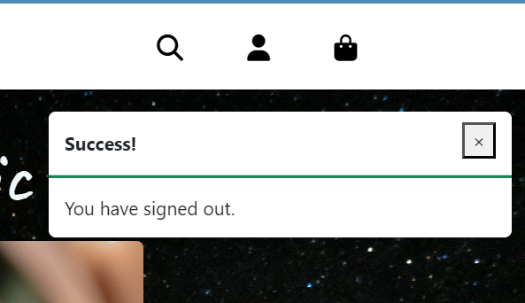
Toast messages were implemented to inform the user about successful actions (like sign in, checkout), alerts (like editing), errors.

**Home page**  
The goal of home page is to present the store to potential shoppers and get them interested. It contains hero image and motto. There are 4 cards showcasing each category of the sold products and stories.
Home page is part of a home app, shown from index template.

**Sign up form**  
Form is provided to allow users to register. Signup template was taken from allauth module and styled to match the site appearance.
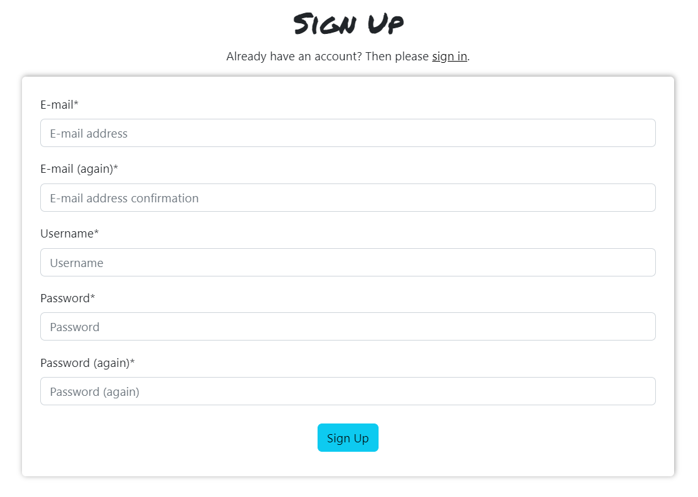

**Log in form and logout**  
Form is provided to allow users to log in. Login template was taken from allauth module and styled to match the site appearance.Logout template was taken from allauth module and styled to match the site appearance. Before logging the user out it confirms, if user wants to log out.

#### App related

**Add product page**

Within the Products app, Add product page with form was made to provide a friendly UI to admin users without them having to use Django admin, when they need to add a new product to the store offer. This is only accessibly to admin users via extra option on the Shop -> Products menu from navbar.

**Edit & delete product**
Admin users can also edit products via edit form or delete it. Both functionalities can be accessed by them via buttons on each product card from products page or from product details. Admin is asked for confirmation before deleting is complete. 

**Products page**
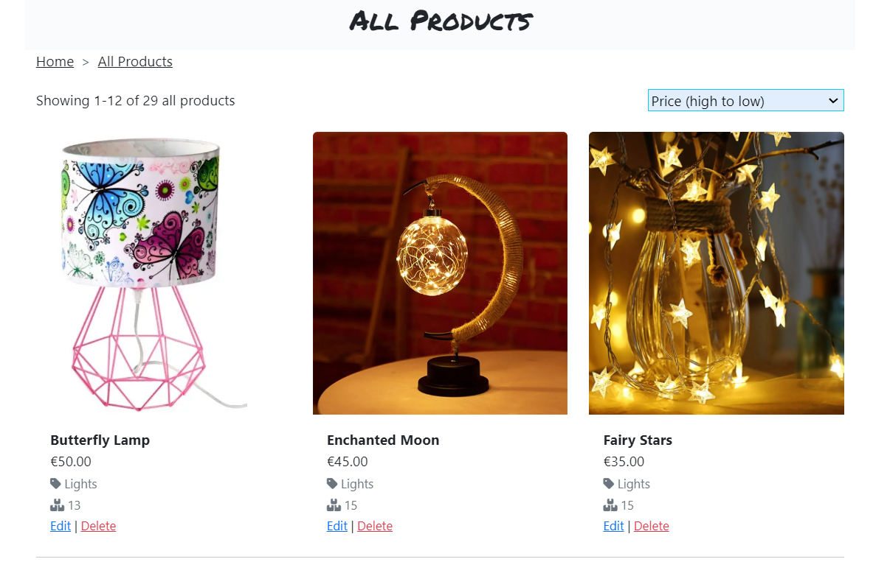
Products page was created to show a list of all available products on offer. It allows the users to sort product by category, alphabetically, price, etc. If shopper clicks specific product category from navbar Shop menu or landing page cards, the page filters and shows products from this specific category. It's in the Products app and is accessible to all viewers of the website without restrictions.

**Product Details**
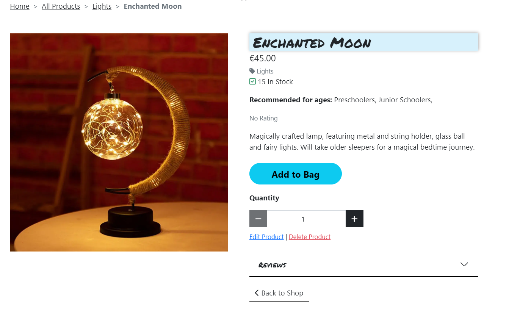
Shoppers are directed to respective Product details page after clicking on one of the product cards on Products page. They can see a more detailed description there, rating, recommended age, price, stock, review section. This is visible for any viewers, but options vary depending on permissions. Admin users have options to access product edit & delete. All shoppers can add products to bag via call to action button. 

**Reviews**
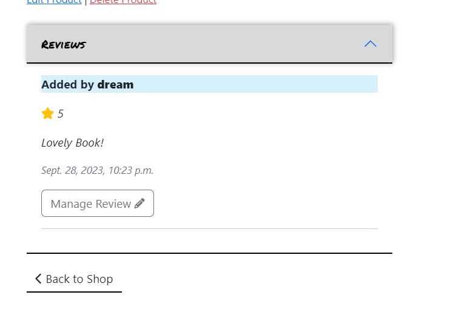
Review section allows logged in users to add a review and also to update/delete previously added reviews by authors. All shoppers can view previously added reviews. Reviews are not deleted if a profile is.

**Bag**
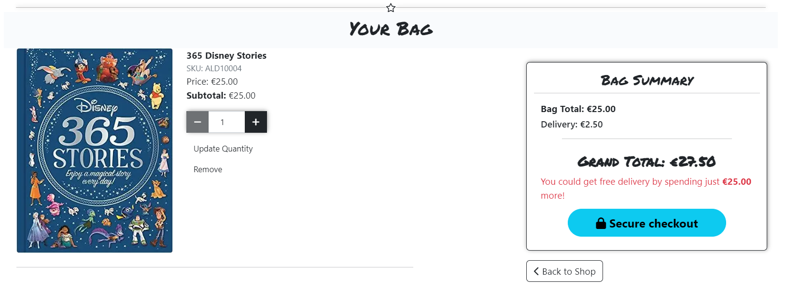
Bag page is accessible via bag icon on the navbar. A tooltip displays bag total on hover. Shopper can proceed to secure checkout via call to action button or go back to shopping.

**Checkout page**
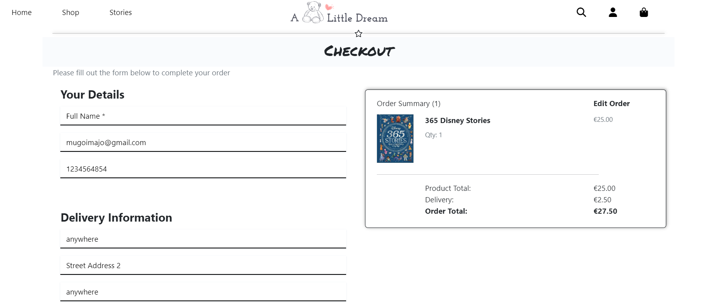
Shoppers are directed to checkout page from bag, they fill out their information, which can also be pre-saved on profile. They can checkout without being logged in, but this way they won't have the order in order history. Payments are set up via Stripe. As this is a test feature, no actual payments will be taken. 

**Order confirmation**
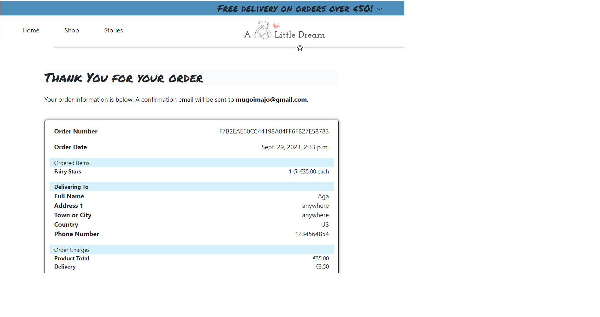
After a successful checkout the shopper is directed to order confirmation page. This can also be later accessed from shopper profile, provided the order was placed when logged in.

**Profile page**
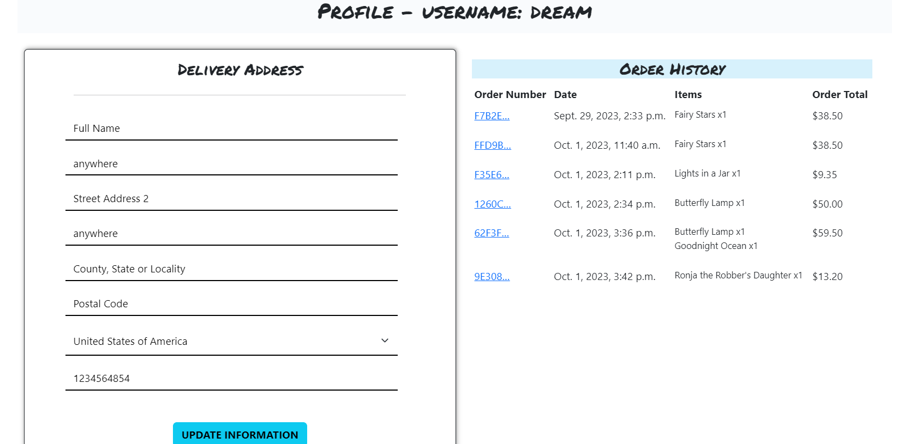
Logged in users can view their profile with personal information, that can be updated by them. It also contains order history and links to each order confirmation.

**Stories page**
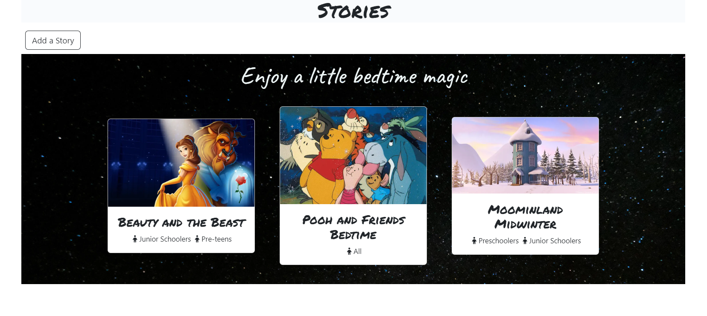
Stories can be accessed via navbar or a card from landing page. Upon clicking a story reader is directed to a story content page, which also contains related product cards for product placing. Stories are a part of marketing strategy and product placement. They're goal is to make the site more attractive to the target customer group, create brand loyalty and enhance product placement.

### Future Features

- Product match advisor
- Users can like stories
- Shoppers can send their own stories for submission

## The Skeleton Plane

### Wireframes

Wireframes were created with Balsamiq. Click below to expand for details.

  
Home page

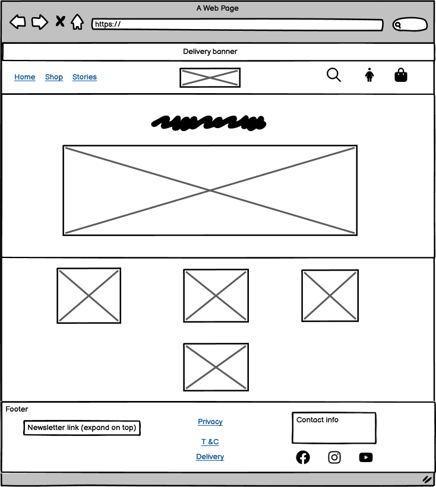

  
Sign up page

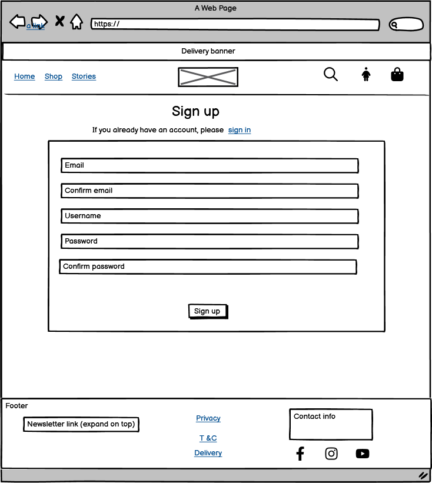
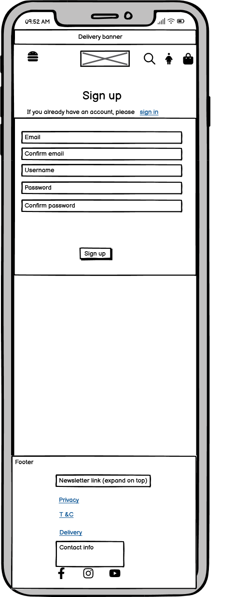

Login, add and edit forms follow the same design. 

  
Products page

  
Product details

  
Stories

  
Story details page

  
Bag

  
Checkout

### Database Design

This project uses PostresQL database hosted on [Elephant SQL](https://www.elephantsql.com/). There are three custom models in the database: Custom User, Room and Booking. The models are related via Foreign Key relationships and . Relationship type can be viewed on the first diagram which was drawn for the design of the database using [Draw SQL](https://drawsql.app/). The second diagram was generated after completion of the project from the ready database with [DBeaver](https://dbeaver.io/).
Social accounts, groups and emails models from allauth modules visible in Django admin were not actively used in the current version, but were left for future deployments.

## The Surface Plane

### Design

Site is responsive and features multiple pages to avoid clutter. It features Bootstrap navbar and cards to
enhance balance and responsiveness. Bootrstrap collapsibles and off-canvas were implemented to avoid text clutter on smaller devices. Navbar links have active class and hover classes, except for logo. This link is primarily implemented for SEO optimization.

### Color palette

Shades of blue and greys were primarily used on primarily white background with some black elements like buttons. Colors harmonize with the starry night hero background and the soft browns of hero image. 

### Typography

Permanent Marker font was used for headings and Caveat font was used for mottos. These fonts add a carefree touch to the site and by evoking a handwriting image. Fonts were obtained from Google fonts.

### Imagery

Store logo was created on Canva. Images were taken from [Pexels](https://www.pexels.com/). All photos were
selected to match the dreamy color design of the site with blues, grays and soft browns as dominating colors.

# Web marketing and SEO

## SEO

## Web marketing

# Technologies

- HTML - the structure of the website was developed using HTML
- CSS - the website was styled using custom CSS in an external file
- Python - for programming within Django framework
- [Django](https://www.djangoproject.com/) - framework for building the project using Python as programming language
- [Bootstrap 5](https://getbootstrap.com/docs/5.0/getting-started/introduction/) - used for adding some predefined elements and styling
- Jinja/Django templating - used to inject dynamic data and queries into HTML pages
- [Favicon.io](https://favicon.io/) - to make favicon
- [Google fonts](https://fonts.google.com/) - Courgette and Marck Script fonts were used
- Chrome Dev Tools - testing/validation/troubleshooting.
- GitHub - for hosting source code
- Git - used to commit and push code during the development of the Website
- Gitpod - website was developed with this IDE in Chrome
- [Tinypng](https://tinypng.com/) - was used to reduce the size of the images
- [Convertio](https://convertio.co/) - for JPG format gallery photos to webp
- Balsamiq - to create wireframes
- [Canva](https://www.canva.com/) - to create site logo
- [Heroku](https://id.heroku.com/login) - to deploy and host live site
- [Font Awesome](https://fontawesome.com/) - for icons on the site
- [DrawSQL](https://drawsql.app/) - to create initial DB schema
- [DBeaver](https://dbeaver.io/) - to create ER diagram after deployment
- [AWS](https://aws.amazon.com//) - for static storage
- [Elephant SQL](https://www.elephantsql.com/) - PostreSQL DB
- [Stripe](https://stripe.com/en-ie) - for payment capturing on checkout

**Python modules**

- Django==3.2.19
- Django class based views - ListView, UpdateView, DeleteView, CreateView - for classes to create, edit, delete and display
- Mixins - LoginRequiredMixin, UserPassesTestMixin - for permissions based restrictions
- Q - for search queries
- messages - for showing user feedback
- date, datetime - for date usage and operations
- dj-database-url==0.5.0 - o parse database url for production environment
- dj3-cloudinary-storage==0.0.6 - storage system to work with cloudinary
- django-allauth==0.54.0 - for authentication
- gunicorn==20.1.0 - WSGI server
- oauthlib==3.2.2 - installed as dependency with another packag
- psycopg2==2.9.6 - for Heroku deployment
- django-richtextfield==1.6.1 - for using custom styling on form fields
- django-crispy-forms==2.0 - for serving forms
- crispy-bootstrap5==0.7 - allow bootstrap5 use with crispy forms
- stripe==6.5.0 - for payment capturing

# Testing

Tests description and results are available in a separate [TESTING.md](TESTING.md) file.

# Deployment

## Version Control  

The following commands were used for version control.

- git add . - add changes to staging area before committing
- git commit -m "commit message" - committing staged changes to the local repository
- git push - pushing commited changes to the GitHub remote repository

## Heroku deployment

Below steps were followed to deploy the project:

- Log in to Heroku
- Click "New -> Create new app" button
- Insert app name, choose region, click the "Create App" button
- On Settings tab go to "Config vars" section, click "Reveal Config Vars"
- Add the following config vars:
  - SECRET_KEY: (secret key)
  - DATABASE_URL: (postresql url)
  - CLOUNDINARY_URL: (cloudinary api url)
- On Deploy tab go to "Deployment method" and select Github
- Go to "App connected to GitHub", type GitHub repository name to link it
- Manual deployment was chosen on the main branch

## Fork repository

Click Fork button on the top right -> select owner -> optionally change name or add description -> create Fork.

## Clone repository

Click on the code button -> select clone with HTTPS, SSH or GitHub CLI -> copy the link shown -> open terminal in your code editor and change the current working directory to the location you want to use for the cloned directory -> type 'git clone' into the terminal and then paste the copied link -> press enter.

# Credits

## References

Below resources were used as reference when creating the project along with Stack Overflow and Code Institute Slack community posts. 
[Django Wednesdays](https://www.youtube.com/watch?v=HHx3tTQWUx0&list=PLCC34OHNcOtqW9BJmgQPPzUpJ8hl49AGy)  
[Django Recipe Tutorial](https://www.youtube.com/watch?v=sBjbty691eI&list=PLXuTq6OsqZjbCSfiLNb2f1FOs8viArjWy&pp=iAQB)

## Images

- 403 & 404 - freefrontend.com
- breakfast in bed - pexels-lisa-fotios-1843244
- continental breakfast - pexels-burst-374052
- irish breakfast - pexels-emrah-tolu-2662875
- vegan - pexels-pixabay-236795
- gluten free - pexels-taryn-elliott-4099238
- hero img - pexels-magic-k-6726764

## Acknowledgments

Big thanks to my Code Institute mentor [Daisy McGirr](https://github.com/Daisy-McG) - for her guidance, support and useful insights.

## Credits
Hero backgrond image - pexels-francesco-ungaro-998641
Hero front image - pexels-ron-lach-8262594
Hero front image 2 - pexels-cottonbro-studio-6670074
Hero front image 3 - pexels-cottonbro-studio-5801245
Books - pexels-pavel-danilyuk-7938252
Lights - pexels-matheus-bertelli-13869602
Stories - johannes-plenio-DKix6Un55mw-unsplash
Story 1 - nightforest_by_maril1_dadimvp-fullview