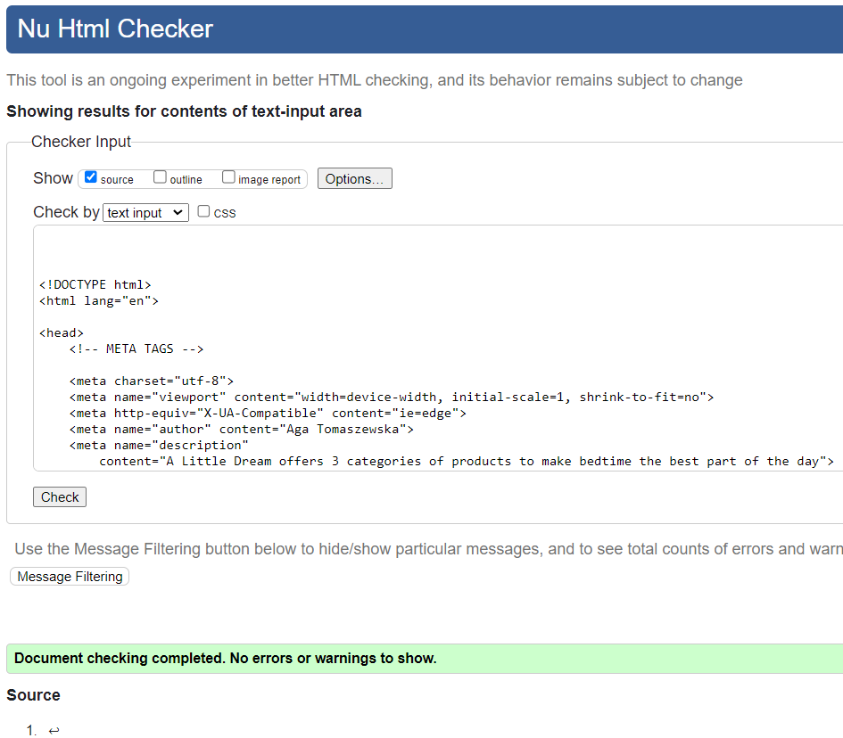
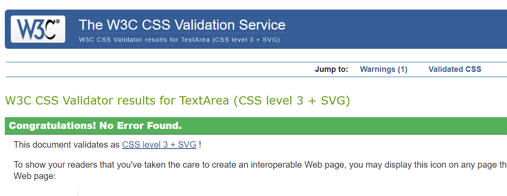
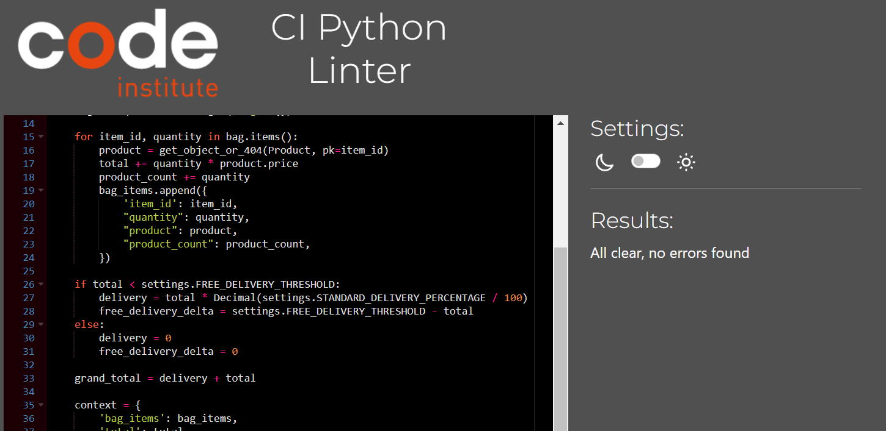
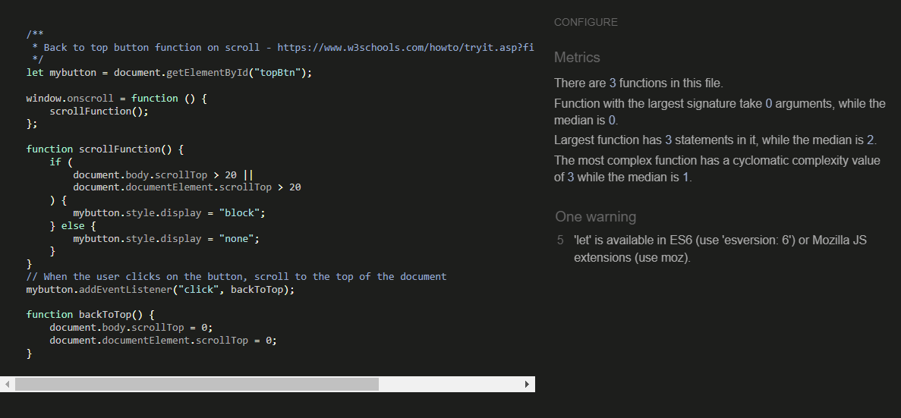

Back to [Readme](README.md)

The site has been thoroughly tested during development, however this document describes tests performed upon completion.

# Table of Contents

- [Functional Testing](#functional-testing)
  - [Links & anchors](#links-anchors)
  - [Forms](#forms)
  - [Products](#products)
  - [Bag and checkout](#bag-checkout)
  - [Admin](#admin)
- [Validator Testing](#validator-testing)
  - [HTML](#html)
  - [CSS](#css)
  - [Python](#python)
  - [JS](#js)
- [Accessibility](#accessibility)
- [Responsiveness](#responsiveness)
- [Lighthouse Report](#lighthouse-report)
- [Unit Tests](#unit-tests)
- [Bugs](#bugs)

# Functional Testing

## Links & anchors
**Description:**
Test all links on the site to ensure they direct to correct pages.

**Steps to test:**

Click all listed links and anchors -> Check if the correct page displays

Tested Navigation Links:

- Home -> index.html
Shop:
- All Products -> products.html
- Cuddlies, Lights, Books - products.html relevant category only
- - Add Product - add_product.html (admin only)
Account:
- Register - signup.html
- Log in -> login.html
- Log out -> logout.html
- Profiles -> profile.html
- Stories -> stories.html
- Bag -> bag.html
- Search -> Expands search bar

Links from Footer:

- Privacy policy - privacy.html
- Terms and conditions - terms.html
- Delivery and shipping - banner expands
- Newsletter - newsletter form expands

Password reset link (login.html)
Email verification link

Anchors - cards:

- Product category cards - open detail pages for correct product categories
- Stories card - opens stories page

Products - buttons & Links:

- Edit & delete product links

Stories - buttons & Links:
- Add, Edit & delete story buttons

Reviews:
- Add Review

**Expected result:**
Correct pages and/or content display from all links

**Actual Result:**
As Expected

**Assessment:**
Pass

## Forms

**Description:**
Test all forms on the site to ensure they function as designed.
### Authentication (Users)

#### Sign up

Test 1 
**Steps to test:**

Enter email address -> Enter email address again -> Enter username -> Enter password -> Repeat same password -> Click submit

**Expected result:**
Form submits, new user is created, success message is displayed to user, new user is showing in admin

Test 2 
**Steps to test:**

Enter email address -> Enter email address again -> Enter username ->Enter password -> Enter different password -> Click submit

**Expected result:**
Form doesn't sumbit, password doesn't match error message is displayed to user

**Actual Results:**
As Expected

**Assessment:**
Pass

#### Log in

Test 1  

**Steps to test:**

Enter username -> Enter password -> Click Sign in
**Expected result:**
Form submits, user is logged in, success message is displayed to user

Test 2  
**Steps to test:**

Enter username -> Enter wrong password -> Click Sign in

**Expected result:**
Form doesn't sumbit, password doesn't match error message is displayed to user

**Actual Results:**
As Expected

**Assessment:**
Pass

#### Log out
**Steps to test:**

Click Sign out button on navbar -> Click Signout on confirmation

**Expected result:**
User gets logged out

**Actual Result:**
As Expected

**Assessment:**
Pass

### Products

#### Add Product

Test 1  

**Steps to test:**
Fill out all fields on the form -> click submit

**Expected result:**
Fields display on form as designed, form submits, product is created with all fields displayed as selected on the form

Test 2  
**Steps to test:**
Fill out all fields on the form, but omit image

**Expected result:**
Form doesn't submit and scrolls to the field that needs to be filled out, if photo or photo alt field a message shows to fill them out

**Actual Results:**
As Expected

**Assessment:**
Pass

#### Edit Product

Test 1  
**Steps to test:**
Edit price -> click Submit

**Expected result:**
Form submits, price field is displayed with the new value

Test 2  
**Steps to test:**
Remove price value -> click Submit

**Expected result:**
Form doesn't submit, a message shows to fill out the price field

**Actual Results:**
As Expected - As a result of testing edit forms, a need for Cancel button was identified to increase edit forms user friendliness.

**Assessment:**
Pass

### Remaining create/edit forms
All remaining create/edit forms on the site were tested according to the above logic. 

## Products

### Stock count
Test 1  
**Steps to test:**
Place an order with product quantity. Check if bought product got deducted from previous quantity on products page.

**Expected result:**
Stock quantity updated.

**Actual Results:**
As Expected - As a result of testing edit forms, a need for Cancel button was identified to increase edit forms user friendliness.

**Assessment:**
Pass

### Quantity update
Test 1  
**Steps to test:**
Increase quantity on the selector. Decrease quantity on the selector. 

**Expected result:**
Quantity changes - plus is disabled when it reaches max stock, minus is disabled at quantity 1.

**Actual Results:**
As Expected.

**Assessment:**
Pass

### Add To Bag
Test 1  
**Steps to test:**
Press Add to Bag button.

**Expected result:**
Product showing in bag.

**Actual Results:**
As Expected 

**Assessment:**
Pass

## Bag and checkout

### Change quantity in bag
Test 1  
**Steps to test:**
Press plus on quantity and click update. Press minus and quick update. Press remove.

**Expected result:**
Quantity updates as designed, order value changes accordingly, product removed. 

**Actual Results:**
As Expected 

**Assessment:**
Pass

### Proceed to checkout
Test 1  
**Steps to test:**
Press Checkout button.

**Expected result:**
Checkout form appears with correct bag contents transferred to summary.

**Actual Results:**
As Expected 

**Assessment:**
Pass

### Complete checkout
Test 1  
**Steps to test:**
Fillout form, enter test card in payment section. Press complete button. Go to Stripe to confirm.

**Expected result:**
Overlay appears, order confirmed, confirmation email is received, payment successful in Stripe.

**Actual Results:**
As Expected - Initially there was a webhook issue, which was preventing sending emails and showing webhook failures. This was fixed by updating the WH secret key.

**Assessment:**
Pass

## Admin

Testing of admin was also performed to ensure the designed functionality of registered model management, especially user management (delete, update permissions), as currently there is no interface available for this functionality on the website.

# Validator Testing

## HTML

Validator used - [W3 Markup Validator](https://validator.w3.org/). All pages were tested. Initially an unclosed div was found and unccessary type attributes on script tags, one of the aria-label was not matching it's element. After fixing these home page is rendering no errors. On one of the details pages, content created with django richtextfield was showing redundant HTML tags. This is fixed for newly created content by replacing Richtextfield with regular CharField in model and form. 

## CSS

Custom CSS code rendered no errors in the [Jigsaw Validator](https://jigsaw.w3.org/css-validator/).

## Python
Initially small errors like trailing whitespaces, no new line at end of document were detected and corrected. All python files with the exception of settings.py are showing no errors.
In settings.py the django auto generated code for AUTH_PASSWORD_VALIDATORS and also cloudinary storage path are showing up as lines too long. I could not find a way to split these lines but since they were auto generated and not my own custom code, I hope this is acceptable.

## JS
Javascript code pieces were tested with [JS Hint](https://jshint.com/). No errors were detected.

# Accessibility

Care was taken to ensure sufficient level of accessibility and user friendliness by using semantic HTML elements and aria-labels. Initial test via [Wave](https://wave.webaim.org/) returned contrast errors, which were corrected. It still returns an error with hero motto contrast, as being detected on white background, even though the background is dard. Also, it shows a missing form label error in the Mailchimp native code and empty link on bag icon, however the link is present. 

# Responsiveness

All pages were checked for responsiveness on different sizes inspected via Chrome Developer tools. Designed layout behaviour was ensured by adding some media queries, where tests shown that elements were overlapping or too cluttered.

# Lighthouse Report

While performance is below desired, due to time contraints it was not possible to improve it by further compressing images (this had already been done previously) and researching what else can be done.

# Bugs

## Solved:
- Stripe webhooks not working - SECRET expired, problem solved after updating the key
- Broken link after user pressed Confirm button on the page displayed from email confirmation link - additional Allauth URL settings added to settings.py to ensure user is logged in after email verification
- djrichtextfield in forms showing HTML tags on website preview - fields were replaced with CharFields

## Unsolved due to deadline:
- search functionality returns double results
- multiselect widget not working on StoryForm (same settings applied as for ProductForm, where it is working)

Back to [Readme](README.md)

